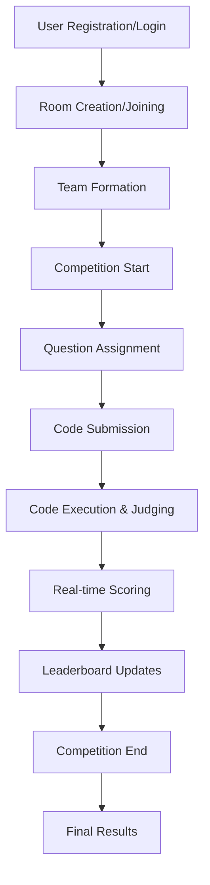

# ClashCode 🏆

A real-time competitive coding platform where developers can battle it out in teams, solve algorithmic challenges, and climb the leaderboard. Built with modern web technologies for seamless code execution and collaborative competition.

## 📸 Screenshots


## 🌟 Features

### Core Functionality
- **Real-time Team Battles**: Create or join coding competitions with live team formation
- **Multi-language Support**: Execute code in Python, JavaScript, Java, and C++
- **Secure Code Execution**: Sandboxed environment with Docker for safe code running
- **Live Leaderboards**: Real-time scoring and ranking during competitions
- **Team Collaboration**: Work together in teams with shared progress tracking

### Competition Features
- **Room-based Competitions**: Create private or public coding rooms
- **Flexible Team Sizes**: Configure teams from 2-10 members
- **Question Assignment**: Automatic or manual question distribution
- **Time-limited Contests**: Configurable contest durations
- **Difficulty Levels**: Easy, Medium, Hard, and Mixed difficulty options

### Technical Features
- **Hidden Test Cases**: Protect solution integrity with hidden test validation
- **Partial Scoring**: Award points based on test case completion percentage
- **Real-time Updates**: WebSocket-powered live updates for all participants
- **Code Editor**: Integrated Monaco editor with syntax highlighting
- **Responsive Design**: Works seamlessly on desktop and mobile devices

## 🚀 Tech Stack

### Backend
- **Runtime**: Node.js with Express.js
- **Database**: MongoDB with Mongoose ODM
- **Authentication**: JWT with bcrypt password hashing
- **Real-time**: Socket.IO for live updates
- **Code Execution**: Docker-based sandboxed execution
- **Email**: Nodemailer for notifications

### Frontend
- **Framework**: Next.js 14 with App Router
- **State Management**: Redux Toolkit
- **UI Components**: Radix UI primitives with Tailwind CSS
- **Animations**: Framer Motion
- **Real-time**: Socket.IO client
- **Icons**: Lucide React

### Infrastructure
- **Containerization**: Docker & Docker Compose
- **Code Execution**: Ubuntu-based execution environment
- **Database**: MongoDB with persistent volumes

## 📁 Project Structure

```
clashcode/
├── backend/
│   ├── src/
│   │   ├── models/          # MongoDB schemas
│   │   │   ├── User.js      # User authentication model
│   │   │   ├── Room.js      # Competition room model
│   │   │   ├── Team.js      # Team formation model
│   │   │   ├── Question.js  # Coding problem model
│   │   │   └── Submission.js # Code submission model
│   │   ├── routes/          # API endpoints
│   │   │   ├── auth.js      # Authentication routes
│   │   │   ├── rooms.js     # Room management
│   │   │   ├── teams.js     # Team operations
│   │   │   ├── questions.js # Question CRUD
│   │   │   └── submit.js    # Code execution & judging
│   │   ├── utils/           # Utility functions
│   │   │   ├── judge0.js    # Code execution engine
│   │   │   ├── normalize.js # Input normalization
│   │   │   └── email.js     # Email utilities
│   │   ├── middleware/      # Express middleware
│   │   │   └── auth.js      # JWT authentication
│   │   ├── server.js        # Main server file
│   │   └── socket.js        # WebSocket handlers
│   ├── Dockerfile.executor  # Code execution container
│   ├── docker-compose.yml   # Multi-service setup
│   ├── package.json
│   └── seed_questions.json  # Sample coding problems
├── frontend/
│   ├── src/
│   │   ├── app/             # Next.js app router
│   │   │   ├── globals.css  # Global styles
│   │   │   ├── layout.jsx   # Root layout
│   │   │   ├── page.jsx     # Home page
│   │   │   ├── login/       # Authentication
│   │   │   ├── register/
│   │   │   ├── forgot-password/
│   │   │   ├── rooms/       # Room listing
│   │   │   └── room/[id]/   # Room-specific pages
│   │   │       ├── waiting/ # Team formation
│   │   │       ├── battle/  # Active competition
│   │   │       └── results/ # Final results
│   │   ├── components/      # Reusable components
│   │   │   ├── common/      # Shared UI components
│   │   │   ├── room/        # Room-specific components
│   │   │   ├── ui/          # Design system
│   │   │   └── Whiteboard/  # Drawing tools
│   │   ├── contexts/        # React contexts
│   │   ├── lib/             # Utilities
│   │   │   ├── axios.js     # API client
│   │   │   ├── socket.js    # WebSocket client
│   │   │   └── utils.js     # Helper functions
│   │   └── store/           # Redux store
│   │       ├── index.js
│   │       └── slices/      # Redux slices
│   ├── public/              # Static assets
│   ├── package.json
│   ├── next.config.js
│   ├── tailwind.config.js
│   └── postcss.config.cjs
└── README.md
```

## 🛠️ Installation & Setup

### Prerequisites
- **Node.js** (v18 or higher)
- **Docker** & **Docker Compose**
- **MongoDB** (local or cloud instance)

### Backend Setup

1. **Clone and navigate to backend:**
   ```bash
   cd backend
   ```

2. **Install dependencies:**
   ```bash
   npm install
   ```

3. **Environment configuration:**
   Create a `.env` file in the backend directory:
   ```env
   MONGO_URI=mongodb://localhost:27017/clashcode
   JWT_SECRET=your-super-secret-jwt-key
   CLIENT_URL=http://localhost:3000
   EMAIL_USER=your-email@gmail.com
   EMAIL_PASS=your-app-password
   ```

4. **Start infrastructure:**
   ```bash
   docker-compose up -d
   ```

5. **Seed the database (optional):**
   ```bash
   # Import sample questions
   curl -X POST http://localhost:5000/questions/bulk \
     -H "Content-Type: application/json" \
     -d @seed_questions.json
   ```

6. **Start the backend server:**
   ```bash
   npm run dev
   ```

### Frontend Setup

1. **Navigate to frontend:**
   ```bash
   cd ../frontend
   ```

2. **Install dependencies:**
   ```bash
   npm install
   ```

3. **Start the development server:**
   ```bash
   npm run dev
   ```

4. **Access the application:**
   Open [http://localhost:3000](http://localhost:3000) in your browser

## 🎮 How to Use

### For Participants

1. **Register/Login**: Create an account or sign in
2. **Browse Rooms**: View available public competitions
3. **Join/Create Room**: Enter a room code or create a new competition
4. **Form Teams**: Create or join teams (2-10 members)
5. **Wait for Start**: Team formation and preparation phase
6. **Code & Compete**: Solve assigned problems within time limits
7. **View Results**: Check final rankings and scores

### For Administrators

1. **Create Room**: Set up competition parameters
2. **Configure Settings**:
   - Team size limits
   - Time duration
   - Difficulty preferences
   - Question count per user
3. **Manage Participants**: Monitor team formation
4. **Start Competition**: Launch the coding battle
5. **Monitor Progress**: Real-time leaderboard updates

## 🔧 API Documentation

### Authentication Endpoints
- `POST /auth/register` - User registration
- `POST /auth/login` - User login
- `POST /auth/forgot-password` - Password reset request
- `GET /auth/me` - Get current user info

### Room Management
- `GET /rooms` - List available rooms
- `POST /rooms` - Create new room
- `GET /rooms/:id` - Get room details
- `POST /rooms/:id/start` - Start competition
- `POST /rooms/leave` - Leave current room

### Team Operations
- `GET /teams/room/:roomId` - Get teams in room
- `POST /teams` - Create new team
- `POST /teams/join` - Join team (by ID or code)
- `POST /teams/:id/leave` - Leave team
- `PATCH /teams/:id/ready` - Toggle ready status
- `DELETE /teams/:id/members/:userId` - Kick member (leader only)

### Question Management
- `GET /questions` - List all questions
- `GET /questions/:id` - Get specific question
- `POST /questions/bulk` - Bulk import questions
- `DELETE /questions/:id` - Delete question

### Code Execution
- `POST /submit` - Submit solution for judging
- `POST /test` - Run against sample test cases
- `POST /run` - Execute code with custom input
- `GET /submissions/room/:roomId` - Get room submissions
- `GET /leaderboard/:roomId` - Get current leaderboard

## 🏗️ Architecture

### Backend Architecture
- **Layered Architecture**: Routes → Controllers → Services → Models
- **Real-time Communication**: Socket.IO for live updates
- **Security**: JWT authentication, input validation, CORS
- **Error Handling**: Centralized error management
- **Code Execution**: Isolated Docker containers for security

### Frontend Architecture
- **Component-based**: Reusable UI components
- **State Management**: Redux for global state
- **Real-time Updates**: Socket.IO client integration
- **Responsive Design**: Mobile-first approach
- **Performance**: Code splitting and lazy loading

### Database Schema
- **Users**: Authentication and profile data
- **Rooms**: Competition configuration and metadata
- **Teams**: Group formation and scoring
- **Questions**: Problem statements and test cases
- **Submissions**: Code submissions and results

## 🔒 Security Features

- **JWT Authentication**: Secure token-based auth
- **Password Hashing**: bcrypt for password security
- **Input Validation**: Comprehensive request validation
- **CORS Protection**: Configured cross-origin policies
- **Code Sandboxing**: Docker isolation for code execution
- **Rate Limiting**: Protection against abuse
- **Hidden Test Cases**: Solution integrity protection

## 🚀 Deployment

### Production Setup

1. **Environment Variables**:
   ```env
   NODE_ENV=production
   MONGO_URI=mongodb://your-production-db
   JWT_SECRET=your-production-jwt-secret
   CLIENT_URL=https://your-domain.com
   ```

2. **Build Frontend**:
   ```bash
   cd frontend
   npm run build
   npm start
   ```

3. **Build Backend**:
   ```bash
   cd backend
   npm run build
   npm start
   ```

4. **Docker Deployment**:
   ```bash
   docker-compose -f docker-compose.prod.yml up -d
   ```

## 👥 Contributors

- **Gowtham S D** – Full Stack Developer & System Architecture
- **Daanish Muhammad A** – Frontend Specialist & UI/UX Design
- **Dharshan K** – Backend Developer & DevOps Engineering

## 📊 Diagrams

### System Flow Diagram



## 🤝 Contributing

1. Fork the repository
2. Create a feature branch (`git checkout -b feature/amazing-feature`)
3. Commit your changes (`git commit -m 'Add amazing feature'`)
4. Push to the branch (`git push origin feature/amazing-feature`)
5. Open a Pull Request

### Development Guidelines
- Follow ESLint configuration
- Write comprehensive tests
- Update documentation
- Use conventional commit messages
- Maintain code quality standards

## 📝 License

This project is licensed under the MIT License - see the [LICENSE](LICENSE) file for details.

## 🙏 Acknowledgments

- **Judge0** for inspiration on code execution
- **LeetCode** for problem inspiration
- **Codeforces** for competition format ideas
- **Open source community** for amazing tools and libraries

## 📞 Support

For support, email support@clashcode.com or join our Discord community.

---

**Happy Coding! 🚀**